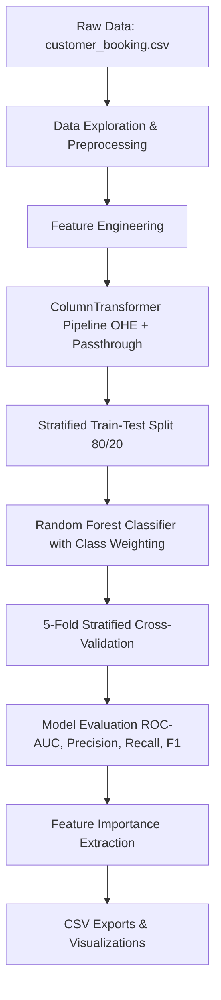

# Airways Customer Booking Prediction & Feature Importance Analysis

[](https://www.python.org/)
[](https://scikit-learn.org/)
[](https://pandas.pydata.org/)
[](#license)

Predicting customer booking completion for airlines using machine learning to uncover key behavioral drivers, optimize conversion rates, and personalize marketing efforts.

---

## 📌 Executive Summary

Understanding customer booking behavior is vital for airlines to optimize dynamic pricing, targeted marketing, ancillary service promotion, and revenue management. This project develops an end-to-end predictive machine learning pipeline using **Random Forest Classification** to analyze **50,000 flight booking interactions**. 

By engineering custom behavioral features (such as departure time periods, purchase lead time bins, and stay duration categories) and handling class imbalance (~15% positive conversion rate), the model achieves a strong **ROC-AUC score of ~0.7904** and an **accuracy of ~85.27%**. The project also extracts key feature importances to highlight the critical factors influencing booking completion.

---

## 📊 Dataset Overview

The dataset (`customer_booking.csv`) comprises 50,000 records detailing customer flight searches, booking configurations, and conversion outcomes.

* **Total Records:** 50,000 rows
* **Total Features:** 14 columns (13 predictors + 1 target variable)
* **Target Variable:** `booking_complete`
  * `0`: Did not complete booking (**42,522 records / ~85.04%**)
  * `1`: Successfully completed booking (**7,478 records / ~14.96%**)

### Feature Dictionary

| Feature Name | Type | Description |
| :--- | :--- | :--- |
| `num_passengers` | Numerical | Number of passengers travelling together |
| `sales_channel` | Categorical | Channel used for booking (e.g., Internet, Mobile) |
| `trip_type` | Categorical | Type of trip (e.g., Round Trip, One Way, Circle Trip) |
| `purchase_lead` | Numerical | Number of days between booking date and flight departure date |
| `length_of_stay` | Numerical | Total number of days stayed at destination |
| `flight_hour` | Numerical | Hour of flight departure (0 to 23) |
| `flight_day` | Categorical | Day of the week of flight departure (Mon, Tue, Wed, etc.) |
| `route` | Categorical | Flight route code (origin to destination) |
| `booking_origin` | Categorical | Country from which the booking was initiated |
| `wants_extra_baggage` | Binary | Whether customer selected extra baggage option (1 = Yes, 0 = No) |
| `wants_preferred_seat` | Binary | Whether customer selected a preferred seat option (1 = Yes, 0 = No) |
| `wants_in_flight_meals` | Binary | Whether customer selected in-flight meal option (1 = Yes, 0 = No) |
| `flight_duration` | Numerical | Duration of the flight in hours |
| **`booking_complete`** | Binary Target | **Target label (1 = Booking completed, 0 = Booking incomplete)** |

---

## 🛠️ Methodology & Workflow



### 1. Data Exploration & Cleaning
* Verified no missing values across all 50,000 records.
* Analyzed class distribution, highlighting a significant class imbalance (~85% non-conversions vs ~15% conversions).
* Evaluated bivariate relationships between booking conversion and categorical options (e.g., extra baggage, seat selection, meal requests).

### 2. Feature Engineering
Created domain-specific categorical groupings to capture non-linear customer behaviors:
* **`flight_period`**: Segmented `flight_hour` into `Night` (<6), `Morning` (<12), `Afternoon` (<18), and `Evening` (>=18).
* **`purchase_lead_category`**: Grouped lead time into `0-7 days`, `8-30 days`, `31-90 days`, and `90+ days`.
* **`stay_category`**: Grouped stay length into `Short` (<=3 days), `Medium` (<=4–7 days), and `Long` (>7 days).

### 3. Pipeline Architecture
* **Categorical Encoding:** `OneHotEncoder(handle_unknown='ignore')` applied to `sales_channel`, `trip_type`, `flight_day`, `route`, `booking_origin`, `flight_period`, `purchase_lead_category`, and `stay_category`.
* **Numerical Pass-through:** `num_passengers`, `purchase_lead`, `length_of_stay`, `flight_hour`, `flight_duration`, `wants_extra_baggage`, `wants_preferred_seat`, and `wants_in_flight_meals`.
* **Classifier:** `RandomForestClassifier(n_estimators=300, class_weight='balanced', random_state=42, n_jobs=-1)`.

### 4. Cross-Validation & Validation Strategy
* Utilized **5-Fold Stratified Cross-Validation** (`StratifiedKFold`) to evaluate stability across folds while preserving minority class ratios.

---

## 📈 Model Performance & Evaluation

The model performance metrics exported to `model_metrics.csv` are summarized below:

| Metric | Score | Description |
| :--- | :--- | :--- |
| **Accuracy** | **85.27%** | Overall proportion of correct predictions |
| **ROC-AUC** | **0.7904** | Capability of distinguishing converters from non-converters |
| **Precision** | **54.55%** | Ratio of true positive conversions among all positive predictions |
| **Recall** | **9.22%** | Ratio of correctly identified positive conversions |
| **F1 Score** | **15.78%** | Harmonic mean of Precision and Recall |

> **Note on Model Performance:**  
> The ROC-AUC of **0.7904** demonstrates strong predictive discriminative ability across decision thresholds. Because `class_weight='balanced'` was tuned for standard probability thresholding (0.50), threshold optimization or hyperparameter tuning can be further applied to boost recall depending on business costs of false negatives versus false positives.

---

## 🔑 Key Feature Importances & Business Insights

The top features influencing booking completion (exported in `feature_importance.csv`) include:

1. **`purchase_lead` (9.28%)**: The number of days prior to departure is the single strongest indicator. Customers booking far in advance exhibit vastly different completion tendencies compared to last-minute searchers.
2. **`length_of_stay` (7.29%)**: Longer trips correlate with higher intent to lock in bookings early.
3. **`flight_hour` (7.11%)**: Specific departure hours strongly align with booking completion decisions.
4. **`flight_duration` (4.57%)**: Flight duration directly impacts commitment, especially for long-haul routes.
5. **`booking_origin_Australia` (4.50%) & `booking_origin_Malaysia` (3.37%)**: Geographic origin plays a crucial role in conversion rate variance.
6. **`num_passengers` (3.44%)**: Group/family bookings show higher conversion stability than individual searchers.
7. **Ancillary Options (`wants_in_flight_meals`, `wants_extra_baggage`, `wants_preferred_seat`)**: Adding add-ons during search serves as an intent signal.

---

## 📁 Repository Structure

```
.
├── customer_booking.csv       # Raw dataset (50,000 records)
├── booking_prediction.ipynb   # Complete analysis & modeling Jupyter Notebook
├── dashboard.html             # Interactive SkyNest Booking & ML Prediction Dashboard
├── feature_importance.csv     # Exported feature importances dataset
├── model_metrics.csv          # Exported evaluation metrics summary
└── README.md                  # Comprehensive project documentation
```

---

## 🚀 Getting Started

### Streamlit operations dashboard

The project now includes `app.py`, a SkyNest-inspired Streamlit dashboard based on the supplied booking-search dataset. It provides filter-responsive live KPIs, conversion and route analytics, managed booking and schedule workflows (session based), CSV export, data-quality checks, and an in-app Random Forest conversion scorer.

Run it from the project directory:

```bash
python -m pip install -r requirements.txt
python -m streamlit run app.py
```

The dashboard opens at `http://localhost:8501`. The schedule and managed-booking queue are deliberately session-managed: `customer_booking.csv` is a historical search/conversion dataset and does not include mutable inventory or flight schedule tables.

### Prerequisites

Ensure you have Python 3.8+ installed. Install the required dependencies using `pip`:

```bash
pip install pandas numpy matplotlib seaborn scikit-learn
```

### Running the Notebook

1. Clone or download this repository.
2. Launch Jupyter Notebook or JupyterLab:
   ```bash
   jupyter notebook booking_prediction.ipynb
   ```
3. Run all cells sequentially to reproduce the data cleaning, feature engineering, model training, cross-validation, visualization plots, and CSV exports.

---

## 💡 Recommendations & Future Work

1. **Probability Threshold Tuning:** Adjust the classification decision threshold lower (e.g., 0.20 - 0.35) to increase recall for high-value targeted marketing campaigns.
2. **Advanced Ensembles:** Explore gradient boosting frameworks like **XGBoost**, **LightGBM**, or **CatBoost** for potentially higher precision-recall tradeoffs.
3. **SMOTE / Resampling:** Experiment with synthetic minority oversampling (SMOTE) or random undersampling to balance minority class detection.
4. **Personalized Nudging:** Deploy real-time push notifications or dynamic discounts for searchers with high lead times and specific stay lengths who show high conversion probability.

---

## 📜 License

This project is open-source and available under the [MIT License](LICENSE).
